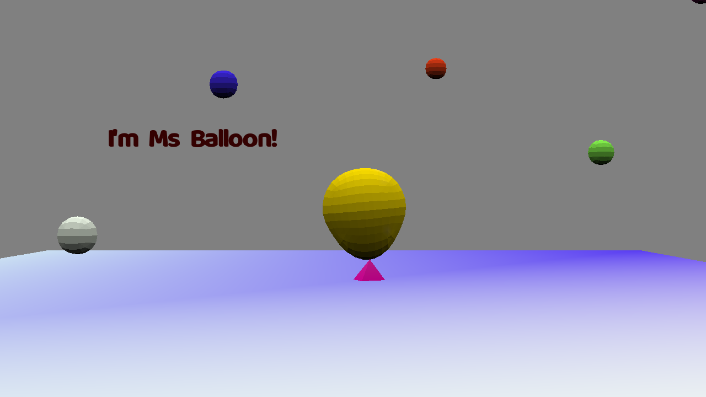

# Miss Balloon

Author: Xinyi Sun

Design: Based on game3, I added in the dialogue component to talk to Miss Balloon.

Text Drawing: The textures of the glyphs for common characters (letters, numbers, punctuations, etc.) are generated once when game starts. During the game, individual text sentences are passed to a text-drawing program which will then read the glyphs of the sentence and load the texture for each and draw each with its unique texture. Dialogue is turned into a special .asset file by the asset generation file dialogue_generation.cpp. The dialogue sentence information is then read by the game program from the .asset files. The dialogue logic flow and connections are hardcoded in the game program at runtime.

Screen Shot:

How To Play:

In dialogue mode, press space to keep the conversation going. In face of choice, use space to toggle between choices and hit enter to make a choice.
In non-dialogue mode, use mouse to navigate the direction of Miss Balloon, use space to move the balloon forward, use W and S to go up and down. When you are close enough to a ball, hit L to listen. Hit C to collect a ball or P to pinch it. This information is also available inside the game.

Sources: I created the 3D model using Blender when making game2. I created the sound files when making game3. The simple dialogue is created by myself. I found the font used in this game on my own Mac (Baloo Regular) but it's under the license specified here at https://www.fontsquirrel.com/fonts/baloo. Since I'm only loading it with no purpose of selling the font or modifying it and using the reserved font name, I'm making legit use of it. Specific code references have been written in the code files.

This game was built with [NEST](NEST.md).

